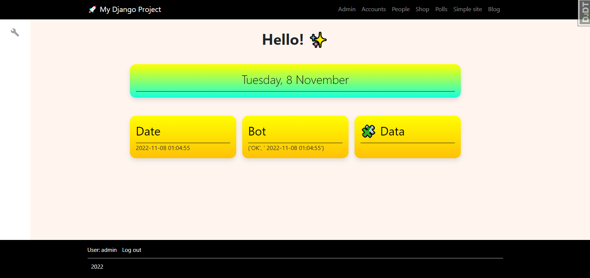

#  ⚡ Django testing ground / Dashboard

---
Private dashboard, user management and store with some code from book Antonio Mele

RUN: python3 manage.py runserver --settings=prod_settings 8000

##  Main features
* Dashboard for own projects
* Shop example
* oauth github
* DRF api
* swagger